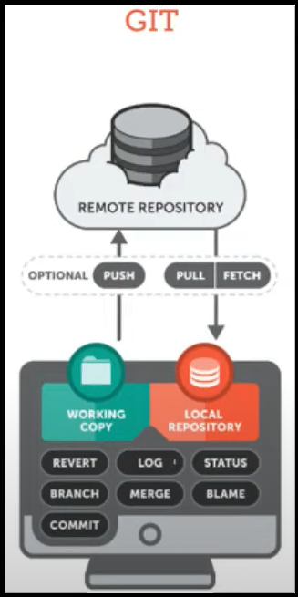
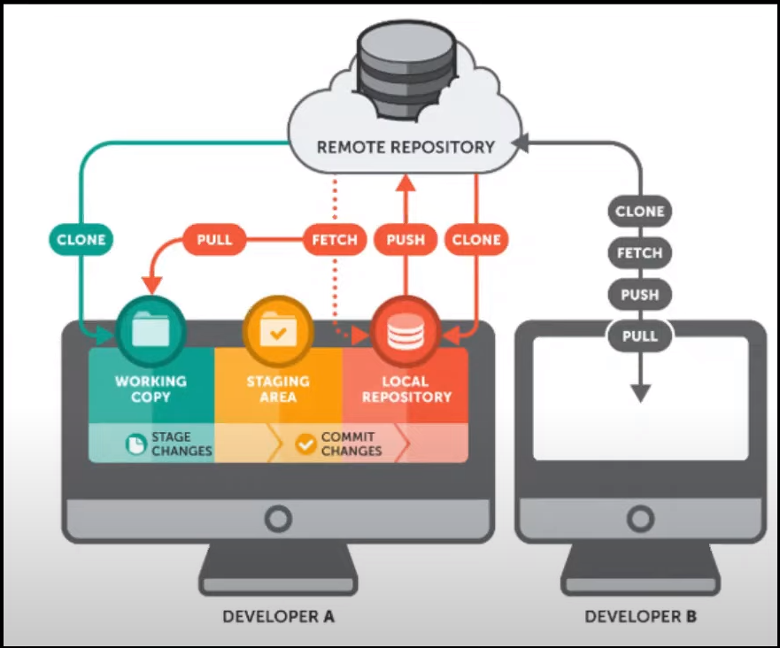

# Lesson 8 REMOTE REPOSITORY

Ôn tập
```shell
git add . #
git commit -m "..." #
```
# GIT: Local repository and Remote repository



# Các bước có thể làm việc với 1 remote REPO
## 1. CLONE
## 2. PULL
## 3. PUSH


VD: DEV_1 có local_repo_1
- Pull central Repo
- Làm việc và commit
- Push lại lên Central repo
 
# Các câu lênh hay dùng
```shell
git init --bare # Tạo 1 central repo 
# Central repo KHÔNG CÓ WORKING DIR
git clone [repo_name] [clone_name] # Sao chép và liên kết repo_name
git fetch # Lấy các thông tin về commit mới từ central repo
git pull # lấy dư liệu từ central về local repo
git push # đẩy các commit từ local lên central repo
```

# Thực hành
Đề bài 
Có 2 menber làm cùng 1 Local project
Làm việc với nhau qua kho lưu trữ central repo

## Central Repository
Bước 1 tạo 1 folder nội bộ. VD: TH_Central_Repo

```shell
# Tạo central repository
mkdir TH_Central_Repo
cd TH_Central_Repo
git init --bare TH_Central_Repo # Tạo central repo

#Tạo ra DEV1 Repo
git clone TH_Central_Repo DEV1

#Tạo ra DEV2 Repo
git clone TH_Central_Repo DEV2

```

## DEV 1
```shell
# Step 1
mkdir DEV_1
cd DEV_1
git config -local user.name "DEV_1"
echo "This is DEV_1's local repository" > DEV1_1.txt
# STEP 2
git add .
git commit -m "Intro - First commit"
git push
```

## DEV 2
```shell
# step 1
mkdir DEV_2
cd DEV_2
git config -local user.name "DEV_2"

# STEP 2
git fetch # Kiểm tra thông tin commit mới ở Central repo
git pull
```
