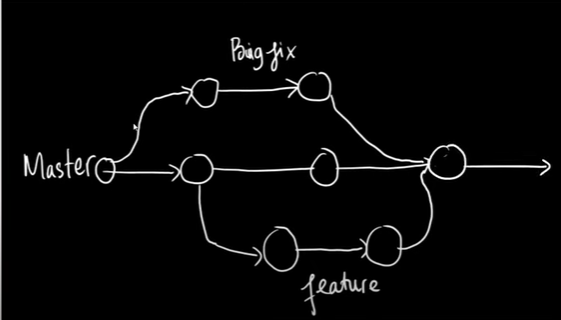
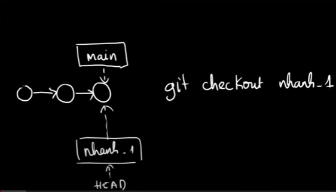
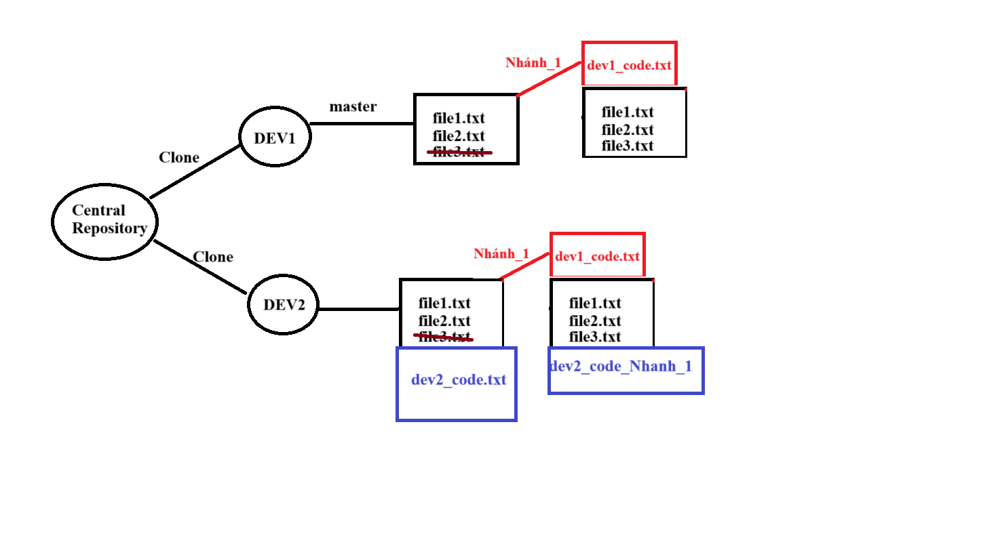

# Lesson 11 - Branches - Nhánh trong GIT

- Nhánh chính: main/master
- Nhánh con

Có thể merge các nhánh với nhau, ví dụ:



Trong project có nhiều người cùng tham gia
- Khi thử nghiệm cần có hướng đi khác 
- Cần quay lại hoặc tiếp tục phát triển 1 nhánh

## CÁC CÂU LỆNH LÀM VIỆC VỚI NHÁNH 

```shell
# tạo nhánh mới
git branch <branch_name>

# Chuyển sang nhánh khác 
git checkout <branch_name>

```
Hình ảnh minh họa:
Nhánh chính có 3 commit 
tạo ra 1 nhánh mới là nhánh featute_1 (tính năng)



```shell
git branch branch_featute_1
git checkout branch_featute_1
```
Mỗi DEV trong project làm việc trên 1 nhánh của riêng mình, sau đó sẽ merge hoặc rebare lại với nhau

```shell
# Xem danh sách các nhánh, và đang làm việc ở nhánh nào 
git branch -l
```

## Thực hành tạo central repo với 2 developers
```shell
# Create a folder contain central repository
mkdir Central_repository
cd Central_repository
# create a central repository
git init --bare Central_repository
# Clone tạo ra 2 DEV repository 
git clone Central_repository DEV1
git clone Central_repository DEV2
# change directory to DEV1 
cd DEV1
echo "file 1" > file1.txt
git add .
git commit -m "Add file file1.txt"
echo "file 2" > file2.txt
git add .
git conmmit -m "Add file2.txt"
# push data to central_repository
git push 
git log # check upload history
cd ..
# Change directory to DEV2
cd DEV2 
git pull # pull data from central Repository
# recived 2 file file1.txt and file2.txt
# Nhánh chính của DEV2 là nhánh master
git branch -l # Xem nhánh hiện tại
cd ..
# Tạo nhánh phụ cho DEV1
cd DEV1
git branch Nhanh_1
# kiểm tra sẽ thấy 2 nhánh là: master và Nhanh_1 
git branch -l 
# Chuyển sanh Nhanh_1 làm việc
git checkout Nhanh_1
# Bắt đầu làm việc ở nhánh này
echo "Tinh nang DEV 1 dang lam" > dev1_code.txt
git add .
git commit -m "Day la code cua DEV1"
# push data lên central repo
# Bị lỗi
git push #lỗi
# Nhánh đang làm việc không phải là upstream branch
# Để đẩy nhánh hiện tại và cài đặt nó như 1 upstream dùng lệnh sau
git push --set-upstream origin Nhanh_1

# Sau khi push quay về nhánh master
git checkout master
#lúc này ls để xem nhánh master có gì
ls # chỉ có file1.txt và file2.txt - KHÔNG CÓ dev1_code.txt vừa tạo
# Create a file3.txt in master branch
echo "file 3" > file3.txt
# chuyển sang Nhanh_1
ls # thấy có file3.txt
git add .
git commit -m "commit file3.txt in branch master at branch Nhanh_1"
git push
cd ..

# move to DEV2 repo
cd DEV2 # master
echo "dev2_code" > dev2_code.txt
git add .
git commit -m "DEV2 create file dev2_code.txt"
ls # file1, file2, dev2_code
git checkout Nhanh_1
ls # file1, file2, file3, dev1_code
# Không có dev2_code
# DEV2 tạo 1 file ở trong Nhanh_1
echo "Tep moi" > dev2_code_Nhanh_1.txt
ls # CÓ các file # file1, file2, file3, dev1_code, dev2_code_Nhanh_1
git add .
git commit -m "DEV2 them 1 file trong Nhanh_1"
# quay lại nhánh master
git checkout master 
git status #  có một commit chưa được push
git push # push data lên 
#
git checkout Nhanh_1
# cũng có 1 commit chưa được push
git push
ls

git checkout master
ls
```


