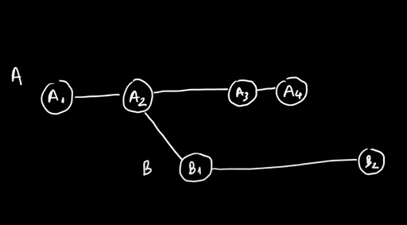
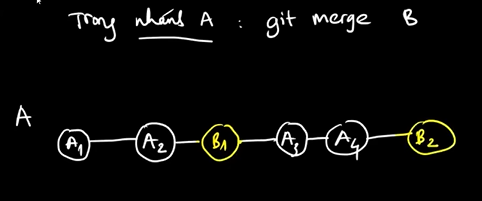

# Lesson 12 -  Cách kết hợp các nhánh lại với nhau - Phần 1

Giải thích:
Merge có nghĩa là trộn.
Khi merge thì chắc chắc sex xảy ra đụng độ, vậy làm sao để giải quyết (có phải là các thủ công như ở VD bài trước ko)

Cú pháp:
```shell
git merge
```
VD: có nhánh sau:



Nếu đứng ở nhánh A, gọi lệnh merger, thứ tự các công việc được sắp theo thứ tự thời gian.



Tạo repo và thực hành theo ví dụ đơn giản trên:

```shell 
#...
```